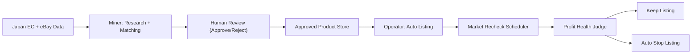

# Program Overview (Reseller)

この文書は、2ツール体制の全体像を共有するための正本です。  
対象:
- Tool 1 (display): `Miner` (internal: `ebayminer`)
- Tool 2 (display): `Operator` (internal: `listing-ops`, planned)

## 1. 目的
- 日本ECとeBayの価格差から、利益が出る候補を安定抽出する。
- 最終承認は人間が行い、誤出品リスクを下げる。
- 承認済み商品のみを次工程へ渡し、出品後も利益が続くか監視する。
- 利益条件を下回った商品は自動停止し、損失の拡大を防ぐ。

## 2. 機能境界
| 領域 | Miner (`ebayminer`) | Operator (`listing-ops`) |
|---|---|---|
| 候補抽出 | 〇 | - |
| 同一商品照合 | 〇 | - |
| 人間レビューUI | 〇 | - |
| 承認済みデータ保存 | 〇 (書き込み) | 〇 (読み込み) |
| 自動出品 | - | 〇 |
| 価格/利益の定期監視 | - | 〇 |
| 自動停止/再開候補管理 | - | 〇 |

## 3. データフロー


## 4. リポジトリ方針
- 当面は1リポジトリ（モノレポ）で運用する。
- 共通ドメインロジックを再利用し、仕様ズレを防ぐ。
- 将来分離するのは次条件を満たした時だけ。
  - 権限管理を完全分離したい
  - リリース周期が大きくズレる
  - CI時間や依存衝突が許容範囲を超える

## 5. 目標ディレクトリ（段階導入）
```text
apps/
  miner/                 # Tool 1 display名 (internal: ebayminer)
  operator/              # Tool 2 display名 (internal: listing-ops)
packages/
  domain/                # 型番正規化、同一商品判定
  profit-engine/         # 利益計算、停止判定
  data-contracts/        # Approved Product 契約
docs/
  PROGRAM_OVERVIEW.md
  OPERATIONS_MANUAL.md
  LOCAL_DB_STRATEGY.md
  DATA_CONTRACT_APPROVED_LISTING.md
```

注記: すぐに移行しない。まずは既存動作を維持し、機能追加を優先する。

## 6. 90日ロードマップ（管理単位）
1. Phase 1 (1-2週): 管理基盤
- GitHub Project, Issue/PRテンプレ, CODEOWNERS を導入。
- 本ドキュメント群を正本として固定。

2. Phase 2 (2-4週): データ接続最小実装
- Miner から「承認済み商品」出力を固定化。
- Operator で読み込みと出品キュー生成を実装。

3. Phase 3 (4-8週): 監視と停止
- 定期再取得ジョブ実装。
- 利益しきい値割れ連続時の自動停止を実装。

4. Phase 4 (8-12週): 安定化
- 誤停止/見逃し率を計測して閾値を調整。
- 運用指標の週次レビューを定着。

## 7. 週次で見るKPI
- 候補抽出数
- 人間承認率
- 出品成功率
- 停止率
- 停止理由トップ3
- 利益率の週次推移

## 8. 関連ドキュメント
- `docs/START_HERE.md`
- `docs/WORKBOARD.md`
- `docs/OPERATIONS_MANUAL.md`
- `docs/INTERNAL_NAME_MIGRATION.md`
- `docs/LOCAL_DB_STRATEGY.md`
- `docs/DATA_CONTRACT_APPROVED_LISTING.md`
